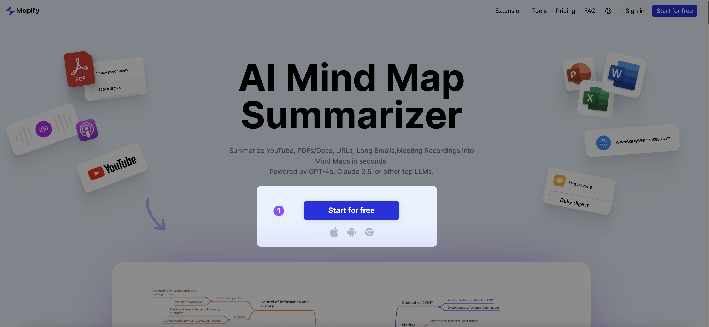
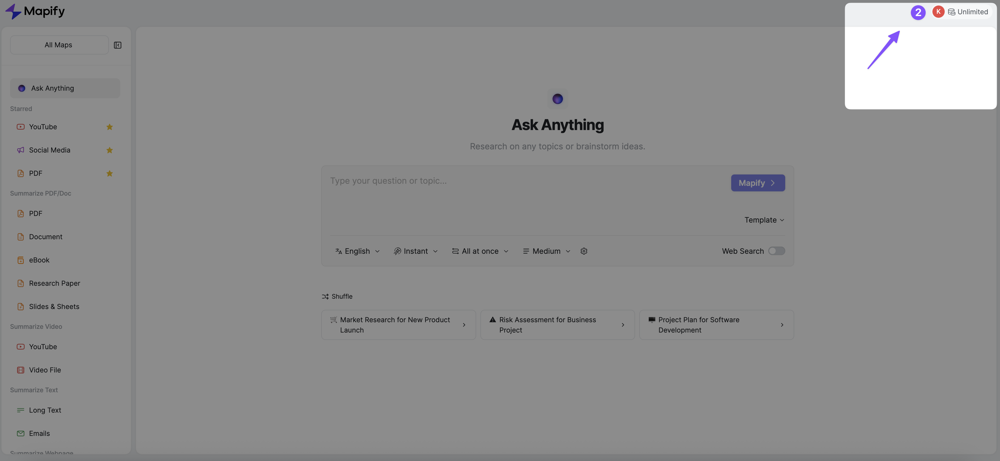
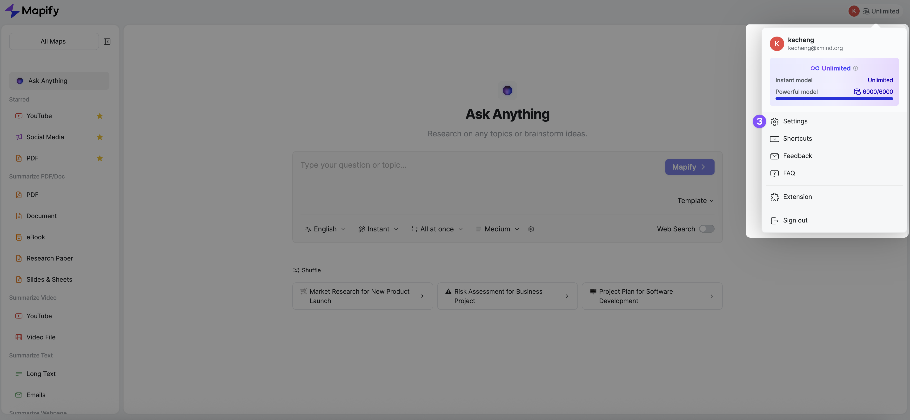

# Mapify MCP Server

[](https://badge.fury.io/js/@xmindltd%2Fmapify-mcp-server)
[](https://opensource.org/licenses/MIT)
[](https://modelcontextprotocol.io/)

**Transform text, YouTube videos, and web content into beautiful mind maps using AI** 🧠✨

The official Mapify Model Context Protocol (MCP) server enables AI assistants like Claude to generate interactive mind maps from various content sources. Built on the standardized MCP architecture, this server provides seamless integration between AI models and Mapify's powerful mind mapping capabilities.

---

## ✨ Features

- **🎯 Multi-Source Mind Mapping**: Generate mind maps from text prompts, YouTube videos, websites, and documents
- **🔍 AI-Powered Search**: Automatically search the web for keywords and create comprehensive mind maps from results
- **🌍 Multi-Language Support**: Create mind maps in 15+ languages including English, Chinese, Japanese, Spanish, and more
- **📸 Visual + Interactive**: Get both static images and editable mind map links

---

## 🔑 Getting Your API Key

Before using the Mapify MCP Server, you'll need to obtain your API token from the Mapify platform.

> 💡 **Already have an account?** Jump directly to [your settings page](https://mapify.so/app#show-settings) and skip to Step 3.

### Step 1: Create Your Account
Visit [mapify.so](https://mapify.so) and sign up for a free account.



### Step 2: Access Main Dashboard
After logging in, you'll see the main Mapify dashboard with your mind maps and tools.



### Step 3: Open Account Settings  
Click on your profile/account menu to access your account settings.



### Step 4: Generate Your API Token
Navigate to the "API Key" section and generate your API key. Copy and keep it secure!


> 🔒 **Security Note**: Treat your API key like a password. Never share it publicly or commit it to version control.

---

## 🚀 Quick Start

### Prerequisites

- **Node.js** (v16 or higher)
- **MCP-compatible client** (Claude Desktop, VS Code, Cursor, Continue, etc.)

### Installation

For **Claude Desktop**, add this configuration to your `~/.claude/claude_desktop_config.json`:

```json
{
  "mcpServers": {
    "mapify": {
      "command": "npx",
      "args": ["-y", "@xmindltd/mapify-mcp-server"],
      "env": {
        "MAPIFY_API_KEY": "your_api_token_here"
      }
    }
  }
}
```

---

## 📖 Usage Examples

Once configured, you can use these tools with your AI assistant:

### Text-to-Mind-Map
```
Create a mind map about "Machine Learning fundamentals"
```

### AI Search to Mind Map
```
Create a comprehensive mind map for "climate change solutions 2025" by AI Search
```

### YouTube Video Analysis  
```
Generate a mind map from this YouTube video: https://youtube.com/watch?v=example
```

### Website Content Mapping
```
Create a mind map from the content on https://example.com/article
```

The AI assistant will automatically:
1. 🔄 Process your request using the appropriate Mapify tool
2. 🌐 Search the web for relevant information
3. 🎨 Generate a beautiful mind map image  
4. 🔗 Provide an editable link for further customization
5. 📊 Return dimensions and metadata

---

## 🛠️ Manual Installation & Development

### Local Setup

```bash
# Clone the repository
git clone https://github.com/xmindltd/mapify-mcp-server.git
cd mapify-mcp-server

# Install dependencies
pnpm install

# Build the project
pnpm run build
```

### Using Pre-built Binary

```json
{
  "mcpServers": {
    "mapify": {
      "command": "node",
      "args": ["/absolute/path/to/mapify-mcp-server/build/index.js"],
      "env": {
        "MAPIFY_API_KEY": "your_api_token_here"
      }
    }
  }
}
```

## 🔗 Links

- **🌟 Mapify Platform**: [mapify.so](https://mapify.so)
- **🐛 Report Issues**: [GitHub Issues](https://github.com/xmindltd/mapify-mcp-server/issues)
- **📖 MCP Specification**: [modelcontextprotocol.io](https://modelcontextprotocol.io)

---

<div align="center">

**Ready to transform any ideas into visual mind maps?** 🚀

[Get Started](https://mapify.so)

</div>